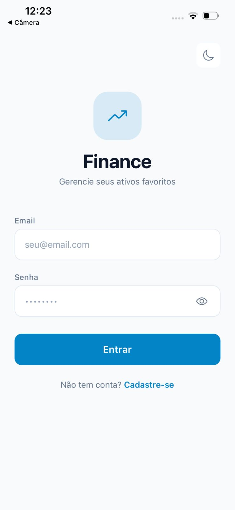
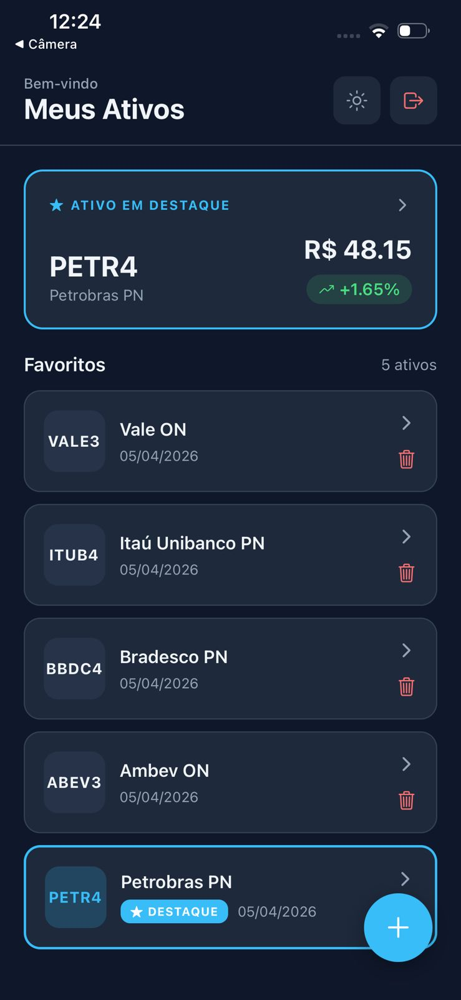
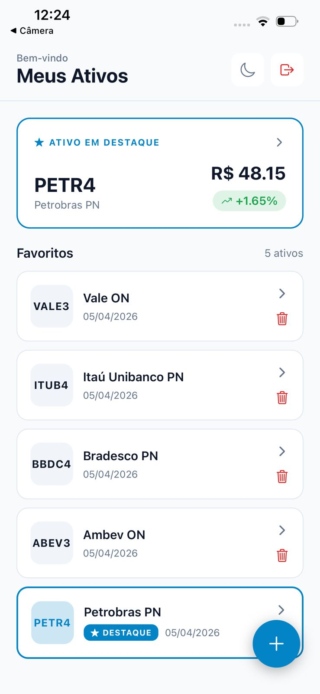
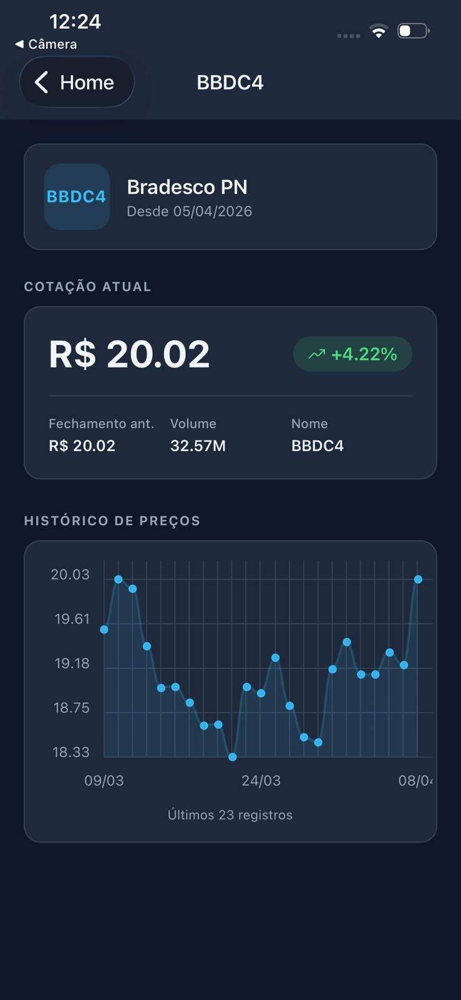
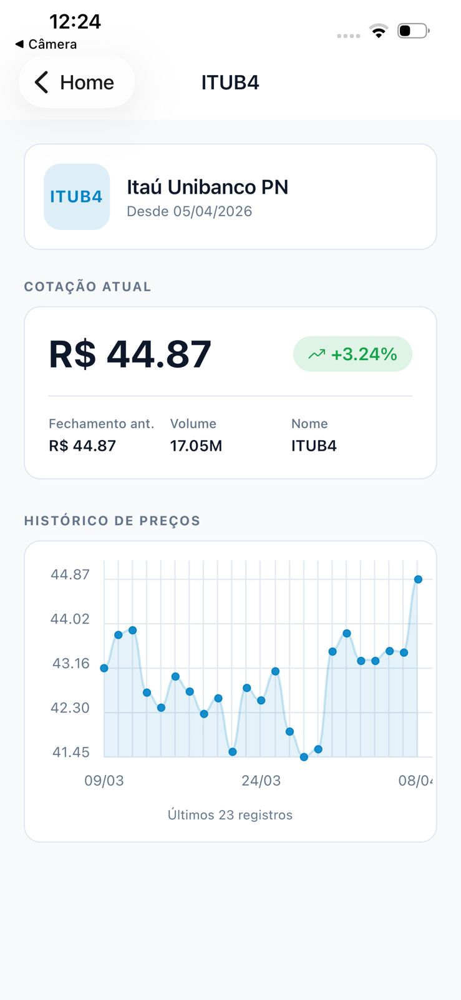

# Finance App — Desafio Técnico Fullstack

Aplicação mobile para consulta de cotações de ativos financeiros, com autenticação JWT, CRUD de favoritos, gráfico histórico de preços e destaque automático do melhor ativo do dia.

---

## Sumário

- [Visão geral](#visão-geral)
- [Screenshots](#screenshots)
- [Arquitetura](#arquitetura)
- [Stack](#stack)
- [Funcionalidades](#funcionalidades)
- [Como subir com Docker (recomendado)](#como-subir-com-docker-recomendado)
- [Como rodar o backend](#como-rodar-o-backend)
- [Como rodar o mobile](#como-rodar-o-mobile)
- [Como executar os testes](#como-executar-os-testes)
- [Endpoints da API](#endpoints-da-api)
- [Variáveis de ambiente](#variáveis-de-ambiente)
- [Regra do ativo em destaque](#regra-do-ativo-em-destaque)
- [Estratégia de atualização periódica](#estratégia-de-atualização-periódica)

---

## Visão geral

O app permite que o usuário:

- Crie uma conta e faça login com JWT (token persistido localmente)
- Cadastre ativos financeiros favoritos (ex: PETR4, VALE3)
- Consulte a cotação atual de cada ativo via [brapi.dev](https://brapi.dev)
- Visualize um **ativo em destaque** com base na maior variação positiva do dia
- Veja o **histórico de preços** de qualquer ativo em gráfico interativo
- Alterne entre **dark mode e light mode**

---

## Screenshots

### Login & Cadastro

<table>
  <tr>
    <td align="center"><b>Dark Mode</b></td>
    <td align="center"><b>Light Mode</b></td>
  </tr>
  <tr>
    <td></td>
    <td></td>
  </tr>
</table>

### Home — Lista de Ativos & Destaque

<table>
  <tr>
    <td align="center"><b>Dark Mode</b></td>
    <td align="center"><b>Light Mode</b></td>
  </tr>
  <tr>
    <td></td>
    <td></td>
  </tr>
</table>

### Detalhe do Ativo — Cotação & Gráfico Histórico

<table>
  <tr>
    <td align="center"><b>Dark Mode</b></td>
    <td align="center"><b>Light Mode</b></td>
  </tr>
  <tr>
    <td></td>
    <td></td>
  </tr>
</table>

---

## Arquitetura

```
mobile-fullstack/
├── back/                        # Backend Python + FastAPI
│   └── app/
│       ├── api/v1/endpoints/    # Controllers (auth, assets, quotes)
│       ├── services/            # Regras de negócio
│       ├── repositories/        # Acesso ao banco (padrão Repository)
│       ├── models/              # SQLAlchemy ORM models
│       ├── schemas/             # Pydantic schemas (request/response)
│       ├── core/                # Config, segurança, scheduler
│       └── tests/               # Testes automatizados (pytest)
│
├── mobile/                      # Mobile React Native + Expo
│   └── src/
│       ├── screens/             # Telas da aplicação
│       ├── components/          # Componentes reutilizáveis
│       ├── services/            # Comunicação com a API (axios)
│       ├── store/               # Estado global (Zustand)
│       ├── navigation/          # Pilha de navegação
│       ├── context/             # ThemeContext (dark/light)
│       └── theme/               # Paleta de cores
│
├── docker-compose.yml
├── Makefile
└── README.md
```

**Fluxo de dados:**

```
Mobile → API (JWT) → FastAPI → PostgreSQL
                  ↘ brapi.dev (cotações externas)
                  ↘ APScheduler (atualização periódica em background)
```

**Decisões de design:**
- `QuoteService` recebe `BrapiService` por injeção de dependência, facilitando mocks nos testes
- Padrão Repository isola o acesso ao banco das regras de negócio
- Histórico de preços persiste no banco a cada consulta e a cada ciclo do scheduler — garantindo dados mesmo sem conexão com a brapi

---

## Stack

| Camada | Tecnologia |
|---|---|
| Mobile | React Native 0.81 + Expo 54 (TypeScript) |
| Navegação | React Navigation v6 |
| Estado | Zustand + React Query |
| Backend | Python 3.12 + FastAPI 0.111 |
| Banco de dados | PostgreSQL 16 |
| ORM | SQLAlchemy 2.0 |
| Autenticação | JWT (python-jose + passlib/bcrypt) |
| HTTP Client (back) | httpx |
| HTTP Client (mobile) | axios |
| Scheduler | APScheduler 3.10 |
| Gráfico | react-native-chart-kit |
| Infraestrutura | Docker + docker-compose |
| Testes | pytest + unittest.mock |

---

## Funcionalidades

- **Autenticação** — cadastro, login e proteção de rotas via JWT
- **CRUD de favoritos** — adicionar, listar, editar e remover ativos
- **Prevenção de duplicatas** — mesmo símbolo não pode ser cadastrado duas vezes pelo mesmo usuário
- **Cotação em tempo real** — consulta à brapi.dev com tratamento de erro
- **Ativo em destaque** — calculado automaticamente com base na maior variação positiva do dia
- **Histórico de preços** — exibido em gráfico de linha com bezier e suporte a até 30 registros
- **Persistência do histórico** — salvo no banco a cada consulta, com fallback automático quando a brapi está indisponível
- **Atualização periódica** — scheduler roda em background a cada 30 minutos
- **Dark / Light mode** — alternância com persistência de preferência
- **Pull-to-refresh** — atualização manual da lista de ativos

---

## Como subir com Docker (recomendado)

### Pré-requisitos

- Docker Desktop instalado e rodando
- Dispositivo mobile com [Expo Go](https://expo.dev/go) instalado
- Computador e dispositivo na **mesma rede Wi-Fi**

### 1. Configure o IP da sua máquina

```bash
# Windows
ipconfig
# Procure: "Adaptador de Rede sem Fio Wi-Fi" → "Endereço IPv4"

# macOS / Linux
ifconfig | grep "inet "
```

Edite o arquivo `.env` na raiz do projeto:

```env
HOST_IP=192.168.0.183   # substitua pelo seu IP
```

### 2. (Opcional) Configure o token da brapi

Edite `back/.env` e preencha o token:

```env
BRAPI_TOKEN=seu_token_aqui
```

> Sem token, a brapi funciona com limite de requisições. Para uso contínuo, obtenha um token gratuito em [brapi.dev](https://brapi.dev).

### 3. Suba o ambiente completo

```bash
make up
```

### 4. Conecte o mobile

Aguarde os logs mostrarem `Bundled` e acesse pelo Expo Go:

```bash
make logs   # acompanhe os logs
```

No app Expo Go, conecte pelo URL:

```
exp://<HOST_IP>:8081
```

### Comandos disponíveis

```bash
make up             # sobe todo o ambiente (backend + db + mobile)
make down           # derruba todo o ambiente
make backend        # sobe apenas backend + banco
make mobile         # sobe apenas o mobile
make logs           # exibe logs de todos os serviços
make logs-backend   # exibe logs apenas do backend
make test           # roda os testes via Docker
make test-local     # roda os testes localmente
```

---

## Como rodar o backend

### Com Docker

```bash
make backend
```

A API ficará disponível em `http://localhost:8000`.

Documentação interativa (Swagger): `http://localhost:8000/docs`

### Localmente (sem Docker)

```bash
cd back
python -m venv .venv
source .venv/bin/activate   # Windows: .venv\Scripts\activate
pip install -r requirements.txt
uvicorn app.main:app --reload
```

> Requer PostgreSQL rodando localmente e `back/.env` configurado com `DATABASE_URL` apontando para ele.

---

## Como rodar o mobile

### Com Docker (dispositivo físico)

```bash
make mobile
```

### Localmente

```bash
cd mobile
npm install
npx expo start
```

Configure a URL da API no arquivo `mobile/.env`:

```env
# Dispositivo físico
EXPO_PUBLIC_API_URL=http://<IP_DA_SUA_MAQUINA>:8000/api/v1

# Simulador iOS
EXPO_PUBLIC_API_URL=http://localhost:8000/api/v1

# Emulador Android
EXPO_PUBLIC_API_URL=http://10.0.2.2:8000/api/v1
```

---

## Como executar os testes

### Via Docker

```bash
make test
```

### Localmente

```bash
make test-local

# ou diretamente
cd back
pytest app/tests -v
```

Os testes cobrem:

| Módulo | Cenários testados |
|---|---|
| Autenticação | Registro, login válido, senha errada, usuário inexistente, rota protegida sem token |
| CRUD de ativos | Criar, listar, buscar por ID, atualizar nome/símbolo, deletar, duplicata (409), isolamento entre usuários |
| Cotações | Consulta com mock da brapi, persistência automática do histórico, ativo não encontrado, erro da API externa |
| Histórico | Retorno da brapi, fallback do banco quando brapi falha, histórico inexistente |
| Destaque | Maior variação positiva, sem ativos, sem histórico, todos negativos retorna `None`, positivo prevalece sobre negativo |
| Scheduler | Atualização chama brapi por símbolo, deduplicação (N usuários com mesmo símbolo = 1 chamada à API) |

---

## Endpoints da API

Base URL: `http://localhost:8000/api/v1`

### Autenticação

| Método | Endpoint | Descrição | Auth |
|---|---|---|---|
| `POST` | `/auth/register` | Cadastra novo usuário | Não |
| `POST` | `/auth/login` | Autentica e retorna JWT | Não |

### Ativos Favoritos

| Método | Endpoint | Descrição | Auth |
|---|---|---|---|
| `POST` | `/assets` | Cadastra ativo favorito | Sim |
| `GET` | `/assets` | Lista todos os ativos do usuário | Sim |
| `GET` | `/assets/{id}` | Busca ativo por ID | Sim |
| `PUT` | `/assets/{id}` | Atualiza nome ou símbolo | Sim |
| `DELETE` | `/assets/{id}` | Remove ativo | Sim |

### Cotações

| Método | Endpoint | Descrição | Auth |
|---|---|---|---|
| `GET` | `/quotes/{symbol}` | Cotação atual do ativo (via brapi) | Sim |
| `GET` | `/quotes/highlight` | Ativo em destaque do usuário | Sim |
| `GET` | `/quotes/{symbol}/history` | Histórico de preços | Sim |

---

## Variáveis de ambiente

### Backend (`back/.env`)

| Variável | Descrição | Padrão |
|---|---|---|
| `DATABASE_URL` | URL de conexão com o PostgreSQL | `postgresql://postgres:postgres@db:5432/finance` |
| `SECRET_KEY` | Chave secreta para assinar os JWTs | `troque-esta-chave-em-producao-123456` |
| `ALGORITHM` | Algoritmo do JWT | `HS256` |
| `ACCESS_TOKEN_EXPIRE_MINUTES` | Expiração do token (minutos) | `1440` (24h) |
| `BRAPI_BASE_URL` | URL base da brapi | `https://brapi.dev/api` |
| `BRAPI_TOKEN` | Token da brapi (opcional) | `` |
| `SCHEDULER_INTERVAL_MINUTES` | Intervalo de atualização periódica | `30` |
| `TESTING` | Desativa o scheduler durante os testes | `false` |

### Raiz do projeto (`.env`)

| Variável | Descrição | Exemplo |
|---|---|---|
| `HOST_IP` | IP local da máquina (Wi-Fi) para o mobile conectar ao backend | `192.168.0.183` |

### Mobile (`mobile/.env`)

| Variável | Descrição |
|---|---|
| `EXPO_PUBLIC_API_URL` | URL base da API backend acessível pelo dispositivo |

---

## Regra do ativo em destaque

O **ativo em destaque** é aquele com a **maior variação percentual positiva** (`change_percent`) entre os ativos favoritos do usuário, com base no último registro de histórico de preços de cada ativo.

```
Destaque = max(change_percent > 0) entre os últimos registros históricos dos ativos do usuário
```

**Critérios:**
- Somente ativos com variação **positiva** são elegíveis
- Se nenhum ativo tiver variação positiva no período, nenhum destaque é retornado
- Em caso de dados ausentes (ativo sem histórico), o ativo é ignorado no cálculo

**Implementação:** [back/app/services/highlight_service.py](back/app/services/highlight_service.py)

---

## Estratégia de atualização periódica

O backend utiliza **APScheduler** com um `BackgroundScheduler` para atualizar as cotações de todos os ativos cadastrados em segundo plano, sem bloquear as requisições da API.

**Como funciona:**

1. A cada `SCHEDULER_INTERVAL_MINUTES` minutos (padrão: **30 min**), o job `refresh_assets` é executado automaticamente
2. O job busca todos os símbolos distintos cadastrados no banco (**deduplicados entre usuários**)
3. Para cada símbolo, consulta a brapi e persiste um novo registro em `price_history`
4. Ativos de diferentes usuários com o mesmo símbolo recebem registros individuais de histórico

**Vantagem da deduplicação:** se 10 usuários têm PETR4, a brapi é consultada apenas **1 vez** por ciclo, mas os 10 usuários recebem o histórico atualizado.

**Implementação:** [back/app/core/scheduler.py](back/app/core/scheduler.py) + [back/app/services/quote_service.py](back/app/services/quote_service.py)
